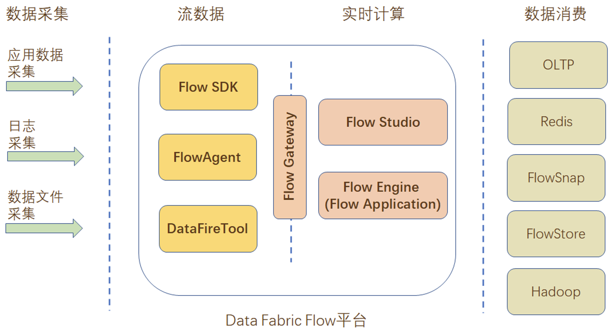
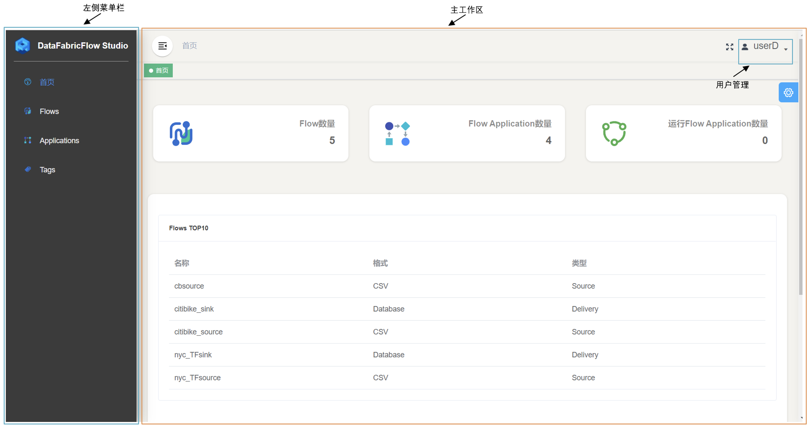
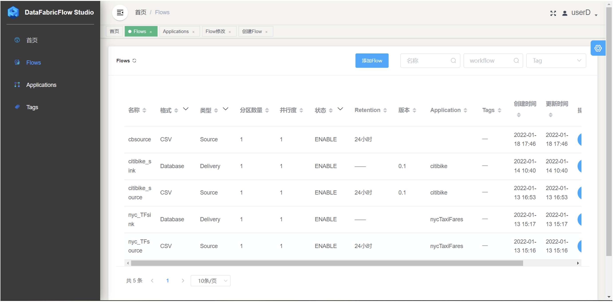
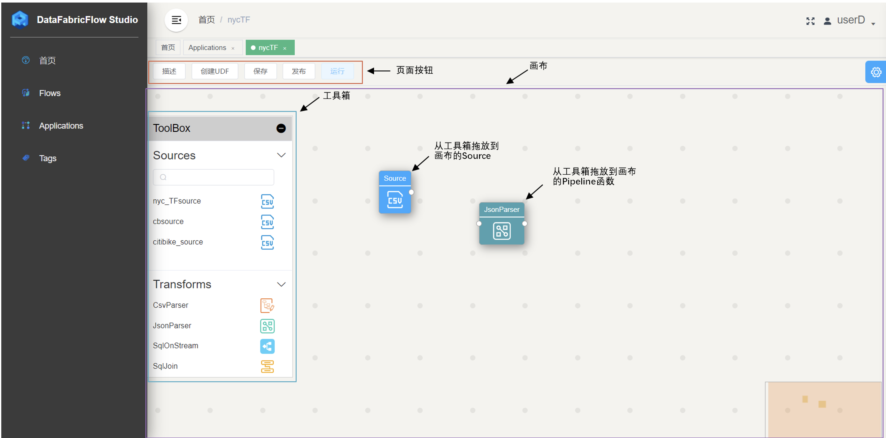

# Flow —— 拖拽式的流式数据管理平台

- **实时**

  Flow 让您可以实时接收、缓冲和处理流数据，因此您可以在几秒或几分钟内得出分析结果，不用等待几小时或几天。

- **持久**

  降低数据丢失的几率，存储该数据长达 365 天。

- **可扩展**

  DataFabricFlow 可以处理来自几十万个来源的任意数量的流数据，延迟非常低。

- **易于使用**

  无需编程或少量编程即可快速构建你的流应用程序。

- **高吞吐低延迟**

  在吞吐量和延迟方面的性能优于Spark Streaming。

## 主要功能

- 简单的构建-运行流应用程序

- 对流数据进行处理和分析

- 将计算结果写进外部存储

- 流管理和应用程序管理

- 数据采集

## 技术架构

以下是Flow平台的各组件介绍：

1. 数据采集工具：将外部系统的数据采集到Data Fabric Flow平台中，以对数据进行实时的处理和分析。目前支持3种采集工具：

   - FlowAgent：将各类的日志文件（tailDir）和xml文件实时地采集并传输到平台中进行处理。目前支持的日志有Syslog，Apache Log，Log4j。

   - DataFireTool：将各类的数据文件实时地采集并传输到平台中进行处理。目前支持的数据格式有CSV，JSON。

   - Flow SDK：如果FlowAgent 和DataFireTool不能满足业务需求，可以使用Flow SDK。Flow SDK支持高度定制化。

2. Flow Gateway：接收实时采集的数据，并保存到平台的FlowStore中

3. Flow Studio：是一个用于创建、运行和管理数据流应用程序（Flow Application）的用户界面（UI，User Interface）

4. Flow Engine：Flow Engine根据用户在Flow Studio中创建的Flow Application，生成一个可执行的应用程序，实际地对数据进行Flow Application里指定的那些处理和分析，并将处理结果保存到外部存储中

## 功能展示

### 主页

包括菜单栏、主工作区展示

### Flow任务列表

Flow任务列表、Application任务列表展示

### Flow创建页面

让用户在画布上拖放并配置

